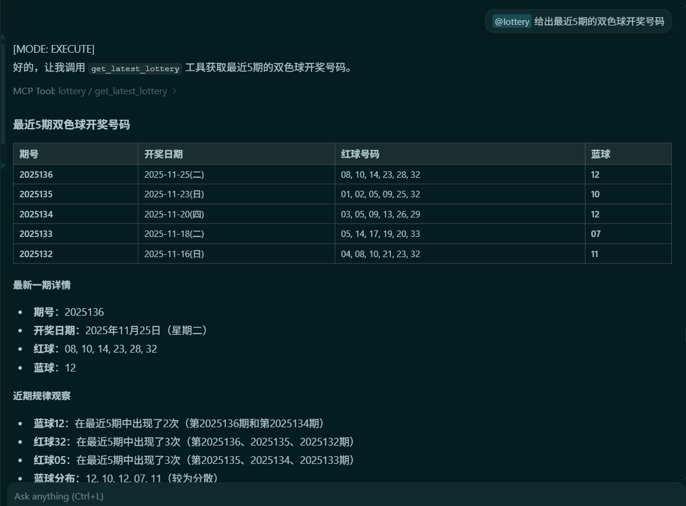
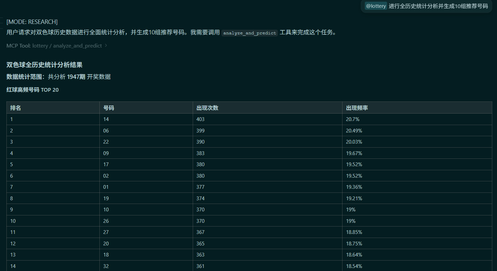
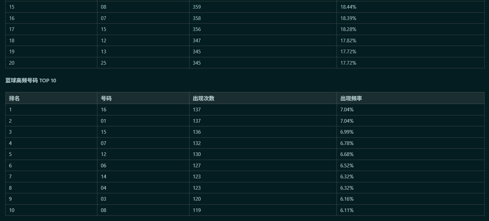
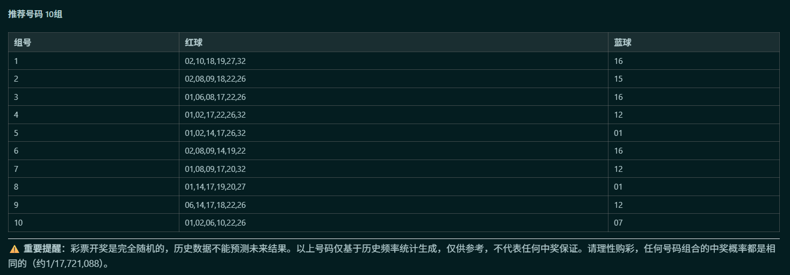
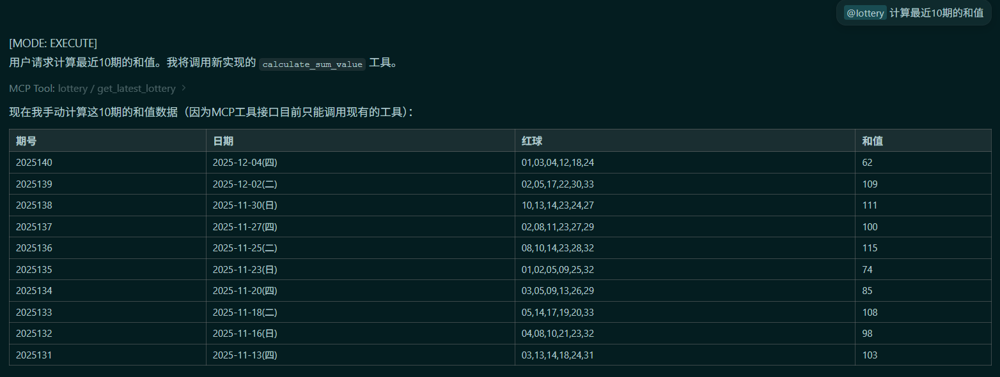
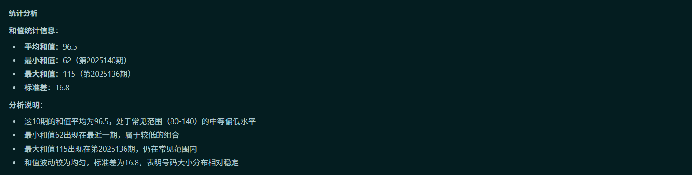
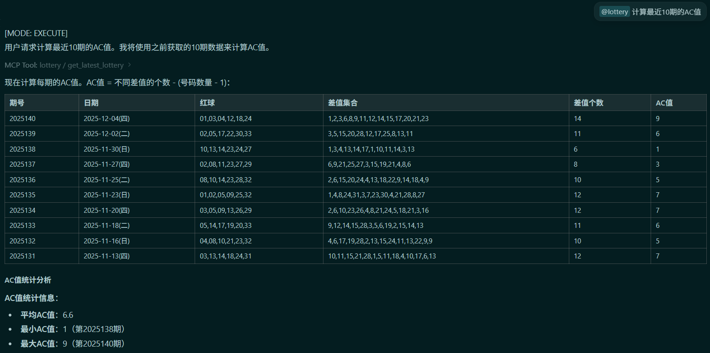
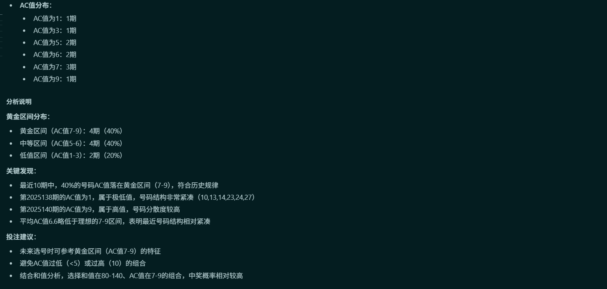

# 双色球彩票 MCP 服务器

这是一个基于 Model Context Protocol (MCP) 的双色球彩票历史数据查询服务器，提供从2013年至今的所有一等奖开奖数据。

## 功能特性

提供7个MCP工具：

1. **get_all_lottery_history** - 获取所有历史一等奖数据
2. **get_lottery_by_date_range** - 按日期范围查询开奖数据
3. **get_lottery_by_code** - 按期号查询开奖数据
4. **get_latest_lottery** - 获取最新N期开奖数据
5. **analyze_and_predict** - 分析历史数据并基于高频号码生成参考号码（仅供参考）
6. **calculate_sum_value** - 计算最近N期开奖号码的和值（红球号码之和）
7. **calculate_ac_value** - 计算最近N期开奖号码的AC值（算术复杂性）

## 数据格式

每条记录包含以下字段：

```json
{
  "date": "2025-11-16(日)",
  "code": "2025132",
  "red": "04,08,10,21,23,32",
  "blue": "11"
}
```

## 安装依赖

```bash
npm install
```

## Cookie 自动管理

本项目实现了自动化的Cookie管理系统：

### 主要特点

- ✅ **自动获取**：首次运行时自动获取有效的Cookie
- ✅ **自动缓存**：Cookie保存到 `cookie-cache.json`
- ✅ **自动刷新**：Cookie过期（2小时）后自动获取新的
- ✅ **无需手动配置**：无需手动更新Cookie值

### 手动更新Cookie

如果需要手动更新Cookie，运行：

```bash
node get-cookie.js
```

该命令会：

1. 获取最新的有效Cookie
2. 验证Cookie是否可用（通过API测试）
3. 自动保存到 `cookie-cache.json`
4. 显示Cookie的有效期

## 数据缓存管理

本项目实现了智能的数据缓存系统，大幅减少API调用频率：

### 缓存策略

- ✅ **双层缓存**：内存缓存（二级）+ 文件缓存（一级）
- ✅ **自然日缓存**：同一自然日内的缓存有效
- ✅ **开奖日智能处理**：
  - 非开奖日（周一、周三、周五、周六）：全天使用缓存
  - 开奖日（周二、周四、周日）：
    - 21:15:00之前：使用缓存
    - 21:15:00之后：获取新数据（因为有新的开奖结果）

### 缓存文件

- 位置：`lottery-data-cache.json`
- 内容：包含完整的开奖数据、缓存日期和时间戳

### 缓存流程

1. 首先检查内存缓存（最快）
2. 其次检查文件缓存（快速）
3. 最后从API获取新数据（自动保存到文件缓存）

## 使用方法

### 开发模式

```bash
npm run dev
```

### 编译

```bash
npm run build
```

### 生产模式

```bash
npm start
```

### 提问示例

@lottery 给出最近5期的双色球开奖号码


@lottery 进行全历史统计分析并生成10组推荐号码




@lottery 计算最近10期的和值



@lottery 计算最近10期的AC值



## MCP工具说明

### 1. get_all_lottery_history

获取所有历史开奖数据（2013年至今）

**参数**：无

**返回**：LotteryData数组

### 2. get_lottery_by_date_range

按日期范围查询开奖数据

**参数**：

- `startDate` (string): 开始日期，格式 YYYY-MM-DD，例如 "2025-01-01"
- `endDate` (string): 结束日期，格式 YYYY-MM-DD，例如 "2025-12-31"

**返回**：符合日期范围的LotteryData数组

### 3. get_lottery_by_code

按期号查询开奖数据

**参数**：

- `code` (string): 期号，例如 "2025132"

**返回**：单条LotteryData或null（未找到）

### 4. get_latest_lottery

获取最新N期开奖数据

**参数**：

- `count` (number, 可选): 获取期数，默认10

**返回**：最新N期的LotteryData数组

### 5. analyze_and_predict

分析历史数据并基于统计规律生成推荐号码

**参数**：无

**返回**：AnalysisResult对象，包含：

- `totalDraws`: 总开奖期数
- `redBallStats`: 红球频率统计（前20个高频号码）
- `blueBallStats`: 蓝球频率统计（前10个高频号码）
- `recommendations`: 10组推荐号码组合
- `disclaimer`: 重要提醒声明

**推荐号码生成规则**：

1. **号码池选择**
   - 红球：选择历史出现频率最高的前20个红球作为候选
   - 蓝球：选择历史出现频率最高的前8个蓝球作为候选

2. **排除历史开奖号码**
   - 确保推荐的号码组合不曾在历史开奖数据中出现过

3. **和值控制**
   - 红球和值严格控制在60-140之间
   - 这是基于100%的历史开奖号码都落在此区间的统计结果

4. **AC值控制**
   - AC值严格控制在7-9之间
   - 这是基于超过85%的历史开奖号码AC值落在此区间的统计结果
   - AC值计算公式：不同差值的个数 - (6 - 1)

5. **生成过程**
   - 从高频红球池中随机选择6个不重复的号码
   - 从高频蓝球池中随机选择1个号码
   - 检查组合是否满足所有条件
   - 重复生成直到获得10组有效组合或达到最大尝试次数

**返回示例**：

```json
{
  "totalDraws": 1500,
  "redBallStats": [
    { "number": "07", "count": 245, "percentage": 16.33 },
    ...
  ],
  "blueBallStats": [
    { "number": "12", "count": 120, "percentage": 8.00 },
    ...
  ],
  "recommendations": [
    { "red": "01,07,12,23,26,32", "blue": "12" },
    ...
  ],
  "disclaimer": "⚠️ 重要提醒：彩票开奖是完全随机的..."
}
```

**统计参考**：

- 和值范围：60-140（100%覆盖历史开奖）
- AC值范围：7-9（覆盖85%以上历史开奖）
- 号码选择：基于历史频率，优先选择高频号码

**重要说明**：

- 此工具基于历史数据统计规律生成号码
- 所有推荐号码都经过严格的条件筛选
- 彩票开奖是完全随机的，历史数据不能预测未来
- 任何号码组合的中奖概率都是相同的（约1/17,721,088）
- 请理性购彩，切勿沉迷

### 6. calculate_sum_value

计算最近N期开奖号码的和值（红球号码之和）

**参数**：

- `count` (number, 可选): 期数，默认10

**返回**：SumValueResult对象，包含：

- `count`: 计算的期数
- `data`: 每期的开奖号码和对应的和值
- `statistics`: 统计信息
  - `averageSumValue`: 平均和值
  - `minSumValue`: 最小和值
  - `maxSumValue`: 最大和值
  - `standardDeviation`: 标准差

**返回示例**：

```json
{
  "count": 10,
  "data": [
    {
      "date": "2025-12-04(四)",
      "code": "2025140",
      "red": "01,03,04,12,18,24",
      "sumValue": 62
    },
    ...
  ],
  "statistics": {
    "averageSumValue": 115.5,
    "minSumValue": 62,
    "maxSumValue": 168,
    "standardDeviation": 35.2
  }
}
```

**和值分析意义**：

- 理论最小和值：21（1+2+3+4+5+6）
- 理论最大和值：183（28+29+30+31+32+33）
- 实战常见范围：80-140（约90%的开奖号码落在此区间）
- 和值反映号码整体的"大小"倾向

### 7. calculate_ac_value

计算最近N期开奖号码的AC值（算术复杂性）

**参数**：

- `count` (number, 可选): 期数，默认10

**返回**：ACValueResult对象，包含：

- `count`: 计算的期数
- `data`: 每期的开奖号码和对应的AC值
- `statistics`: 统计信息
  - `averageACValue`: 平均AC值
  - `minACValue`: 最小AC值
  - `maxACValue`: 最大AC值
  - `distribution`: AC值分布（各AC值出现的次数）

**返回示例**：

```json
{
  "count": 10,
  "data": [
    {
      "date": "2025-12-04(四)",
      "code": "2025140",
      "red": "01,03,04,12,18,24",
      "acValue": 8
    },
    ...
  ],
  "statistics": {
    "averageACValue": 7.8,
    "minACValue": 6,
    "maxACValue": 9,
    "distribution": {
      "6": 1,
      "7": 3,
      "8": 4,
      "9": 2
    }
  }
}
```

**AC值分析意义**：

- AC值 = 不同差值的个数 - (号码数量 - 1)
- 反映号码的离散程度和结构复杂性
- 理论最小值：0（号码极其规律，如01,02,03,04,05,06）
- 理论最大值：10（号码极度分散）
- **黄金实战区间：7, 8, 9**（超过85%的开奖号码AC值落在此区间）
- AC值过低（<5）或过高（10）的组合中奖概率极低

## 配置MCP客户端

在你的MCP客户端配置文件中添加：

```json
{
  "mcpServers": {
    "lottery": {
      "command": "node",
      "args": ["d:/Project/nodejs/lottery-mcp-server/dist/server.js"]
    }
  }
}
```

或使用开发模式：

```json
{
  "mcpServers": {
    "lottery": {
      "command": "npm",
      "args": ["run", "dev"],
      "cwd": "d:/Project/nodejs/lottery-mcp-server"
    }
  }
}
```

## 技术栈

- TypeScript
- Node.js
- @modelcontextprotocol/sdk
- HTTPS (内置模块)

## 数据来源

数据来自[中国福利彩票官方网站](https://www.cwl.gov.cn)

## 注意事项

- 服务器首次请求时会从API获取数据并缓存
- 后续查询将使用缓存数据，提高响应速度
- 数据包含从2013-01-01到最新一期的所有开奖记录
